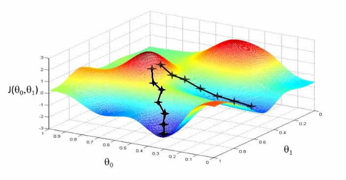
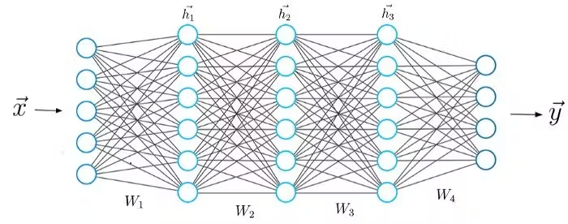
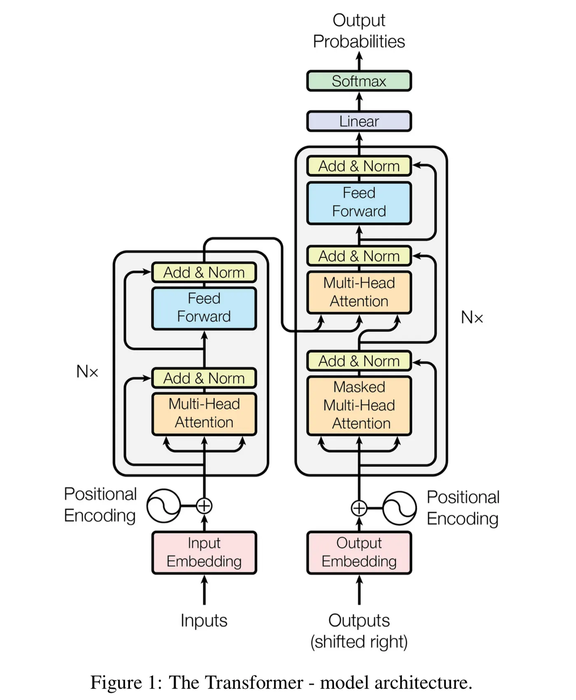

<!-- _class: lead -->

# Understanding AI and Large Language Models

## From Predictive Text to ChatGPT

### A Journey into Modern AI
#### For Incoming College Students

---

# Agenda

1. **Foundations** - Building blocks of AI
2. **The Revolution** - How transformers changed everything  
3. **How LLMs Work** - The inner mechanics
4. **Beyond Text** - Diffusion models and multimodal AI
5. **Practical Considerations** - Real-world deployment
6. **Looking Forward** - The future of AI

---

<!-- _class: lead -->

# Part 1: Foundations
## Building Blocks of AI

---

### Let's Start With Something Familiar

Open your phone and start typing a message...

> "I'll be there in..." → **"10" "minutes" "soon"**

This is **predictive text** - the ancestor of ChatGPT!

#### How it works:
- **N-grams**: Predicting next word based on previous words
- Counts word frequencies in large text collections
- "I'll be" → often followed by "there", "back", "late"

> **Key Insight:** What if we could predict not just words, but understand context and meaning?

---

# Evolution: From Rules to Neural Networks

| Era | Approach | Example |
|-----|----------|---------|
| **1950s-1980s** | Rule-based | `if word == "Hello": suggest("World")` |
| **1990s-2000s** | Statistical (N-grams) | `P("world"\|"hello") = 0.73` |
| **2010s** | Deep Learning | Neural networks learn patterns |
| **2017-Present** | Transformers | Attention mechanism changes everything! |

Each era built on the previous, leading to today's AI revolution

---

# What is a Model?

> **A model is just numbers (weights) arranged in a specific pattern**

### Think of it like a recipe:

**Ingredients**
- Input text
- Training data
- Computing power

**Instructions**
- Neural network architecture
- Billions of weights
- Mathematical operations

**Result:** Output predictions! 

*These weights start random and get adjusted through training*

---

# Training vs Inference

### Training
- Teaching the model patterns
- Adjusting billions of weights
- Like learning to ride a bike
- Happens **once**
- Very expensive ($$$)
- Takes weeks/months

### Inference
- Using what was learned
- Weights are frozen
- Actually riding the bike
- Happens **every chat**
- Relatively cheap
- Takes milliseconds

---

# How Neural Networks Learn: Gradient Descent

## The Training Process

**Gradient Descent** - Like hiking down a mountain in the dark:
- Calculate the error (how wrong we are)
- Find the steepest downhill direction
- Take a small step in that direction
- Repeat millions of times

---

### Training Loop:
1. **Forward Pass**: Input → Predictions
2. **Calculate Loss**: Compare to correct answers
3. **Backward Pass**: Calculate gradients
4. **Update Weights**: Adjust based on gradients
5. **Repeat**: Until model converges

---

<!-- _class: lead -->

# Part 2: The Revolution
## How Transformers Changed Everything

---

<!-- _class: split -->

# "Attention is All You Need" (2017)

## The paper that launched the modern AI era

### Key Innovation: **Attention Mechanism**

The model can "focus" on relevant parts of the input

> **Analogy:** Reading a book and being able to instantly refer back to any previous page, understanding how every word relates to every other word

---

# Why Transformers Matter

| Feature | Impact | Result |
|---------|--------|--------|
| **Parallel Processing** | Process all words simultaneously | 100x faster training |
| **Long-range Dependencies** | Connect ideas across documents | Better understanding |
| **Scalability** | Performance improves with size | Predictable scaling |
| **Transfer Learning** | Pre-train once, use many tasks | Cost efficiency |

Transformers solved the fundamental problems that held back previous approaches

---
## Large Language Models (LLMs)

### Transformer models trained on massive amounts of text

| Model | Parameters | Training Data | Context Window |
|-------|-----------|---------------|----------------|
| **GPT-2** (2019) | 1.5 Billion | 40GB text | 1K tokens |
| **GPT-3** (2020) | 175 Billion | 570GB text | 2K tokens |
| **GPT-4** (2023) | ~1.7 Trillion* | ~13T tokens | 128K tokens |
| **Claude 3** (2024) | Not disclosed | Not disclosed | 200K tokens |

*Estimated, not officially disclosed

> **Scaling Law:** 10x more parameters → Predictable improvement

> **But:** 10x parameters → 100x training cost!

---

<!-- _class: lead -->

# Part 3: How LLMs Work
## The Inner Mechanics

---

# Tokenization: Breaking Down Language

Models don't see words, they see **tokens**

### Example:
"Understanding AI" becomes:
[Under] [standing] [AI]

### Vocabulary Sizes:
- **GPT-3:** ~50,000 tokens
- **Claude:** ~100,000 tokens
- **Llama:** ~32,000 tokens

> **Note:** Different tokenization = Different costs!

---

## Autoregressive Generation

### Models generate one token at a time, using ALL previous tokens

Message 1: "Hello" 
  → Process: "Hello"

Message 2: "How are you?" 
  → Process: "Hello" + "How are you?"

Message 3: "Tell me about AI" 
  → Process: ALL previous + new

### Implications:
- Longer conversations = More computation
- Each response considers entire history
- Context window limits conversation length
- Cost increases with conversation length

---

# Context Windows

## The maximum amount of text a model can "remember"

| Model | Context Window | Equivalent |
|-------|---------------|------------|
| **GPT-3.5** | 4K tokens | ~3,000 words (~6 pages) |
| **GPT-4** | 8K-128K tokens | ~6-100 pages |
| **Claude 3** | 200K tokens | ~150,000 words (a novel!) |
| **Gemini 1.5** | 1M tokens | ~750,000 words (7 novels!) |

### Trade-offs:
**Longer Context** = More information
**More Compute** = Quadratic scaling  
**Higher Cost** = More expensive

---

# Latent Space: The Model's "Understanding"

## Abstract representation of concepts inside the model

Think of it as a massive map where:
- "Cat" is close to "Dog" (both pets)
- "King" - "Man" + "Woman" ≈ "Queen"
- Similar concepts cluster together

### This enables:
- Creative connections between ideas
- Understanding analogies and metaphors
- Transfer knowledge between domains
- Zero-shot learning (new tasks without training)

---

<!-- _class: lead -->

# Part 4: Beyond Text
## Diffusion Models and Multimodal AI

---

# Diffusion Models for Images

## Different approach from language models

### The Process:
1. Start with random noise
2. Gradually remove noise (denoise)
3. Guide with text description
4. Result: Generated image

### Popular Models:
- **DALL-E 3** - OpenAI
- **Midjourney** - Independent lab
- **Stable Diffusion** - Open source

> **Key Innovation:** Text embeddings from language models guide image generation

---

# Multimodal AI: Connecting Everything

## One model, many modalities

### Current Capabilities:
- Text → Image (DALL-E)
- Image → Text (GPT-4V)
- Text → Audio (ElevenLabs)
- Audio → Text (Whisper)
- Text → Video (Sora)

### Future Vision:
- Single model handles all modalities
- Seamless translation between formats
- Real-world understanding
- Embodied AI agents

---

<!-- _class: lead -->

# Part 5: Practical Considerations
## Real-World AI Deployment

---

# Why Training is Expensive

GPT-4 Training: $100+ Million

### Cost Breakdown:

| Component | Details | Cost Factor |
|-----------|---------|-------------|
| **Hardware** | 10,000+ NVIDIA H100 GPUs @ $30K each | $300M+ |
| **Electricity** | ~50 GWh total (small city for months) | $5M+ |
| **Time** | 3-6 months continuous computation | Opportunity cost |
| **Team** | 50+ researchers & engineers | $10M+ |
| **Data** | Collection, cleaning, validation | $5M+ |

---

# Customization: Context vs Fine-tuning

## Context/Prompting 📝

**When to use:**
- Temporary instructions
- Document analysis
- Quick adaptations

**Example:**
You are a pirate. Answer 
as a pirate would.

User: What is AI?
AI: Arr, AI be like...

Free, instant
Limited, temporary

## Fine-tuning

**When to use:**
- Permanent changes
- Domain expertise
- Production deployment

**Example:**
model = finetune(
    base="llama-2",
    data="medical.txt",
    epochs=3
)

Powerful, permanent
Expensive, complex

---

# LoRA: Efficient Fine-tuning

## Low-Rank Adaptation: Fine-tune without modifying all weights

# Traditional fine-tuning (expensive)
W_new = W_original + ΔW  # ΔW is huge!

# LoRA (efficient)
W_new = W_original + A @ B  # A and B are small!

### Benefits:
- **1000x** fewer parameters to train
- **10x** faster training
- Multiple adapters can be swapped
- Run on consumer GPUs

### Real-world use:
- Medical Llama: 1GB adapter file
- Legal Llama: Different 1GB adapter
- Switch between domains instantly

---

# Open Source vs Closed Source

| Aspect | Closed Source | Open Source |
|--------|--------------|-------------|
| **Examples** | GPT-4, Claude, Gemini | Llama 3, Mistral, Qwen |
| **Performance** | State-of-the-art | ~90% of closed models |
| **Cost** | $20/month or API fees | Free (need hardware) |
| **Privacy** | Data sent to provider | Run locally |
| **Customization** | Limited | Complete freedom |
| **Transparency** | Black box | See everything |

> **Trend:** Gap narrowing rapidly. Llama 3.1 405B ≈ GPT-4 performance!

---

<!-- _class: lead -->

# Part 6: Looking Forward
## The Future of AI

---

# Emerging Trends

| Trend | Description | Impact |
|-------|-------------|--------|
| **Multimodal Models** | Text + Images + Audio + Video | Universal AI assistants |
| **Edge AI** | Models on phones/laptops | Privacy + No internet |
| **AI Agents** | Models that take actions | Automation revolution |
| **Reasoning Models** | Step-by-step thinking (o1, o3) | Complex problem solving |
| **Scientific AI** | Protein folding, drug discovery | Research acceleration |

The pace of progress is accelerating exponentially

---

# For College Students

## Good Uses:
- Brainstorming and ideation
- Learning complex concepts
- Code assistance/debugging
- Research organization
- Writing feedback (not writing)
- Creating study materials
- Language practice

## Avoid:
- Submitting AI work as yours
- Bypassing learning objectives
- Violating academic policies
- Over-relying on AI
- Not verifying AI output
- Using for exams/tests
- Plagiarism

> **Remember:** AI is a tool to enhance learning, not replace it!

---

# Skills That Matter MORE With AI

### **Critical Thinking**
Evaluating AI outputs, spotting errors, verification

### **Asking Good Questions**
Prompt engineering, problem decomposition

### **Creativity**
Using AI as a collaborator, not replacement

### **Human Skills**
Empathy, leadership, communication, ethics

### **Domain Expertise**
Deep knowledge AI can't replace

> **Key Insight:** AI handles routine → Humans focus on creative & strategic work

# Resources to Get Started

## Free Learning:
- **Catalyst** - Multiple AI Inference [Catalyst](https://catalyst.voov.ai)
- **Hugging Face** - Tutorials & models
- **Google Colab** - Free GPUs
- **Reddit** - r/LocalLLaMA
- **YouTube** - [Adrej Karpathy](https://www.youtube.com/andrejkarpathy)

## Experiment With:
- **ChatGPT/Claude** - Start here
- **Ollama** - Run models locally
- **Stable Diffusion** - Generate images
- **LangChain** - Build AI apps
- **Cursor** - AI coding

### First Projects:
1. Build a chatbot for study notes
2. Fine-tune a model on your writing
3. Create an AI teaching assistant

---

# Key Takeaways

- AI models are just weights learned from data
- Transformers revolutionized AI with attention
- Bigger models work better but cost more
- Understanding tokenization and context is crucial
- Open source is democratizing AI
- AI is a tool - learn to use it wisely

> ## The AI revolution is just beginning.
> ## You're entering college at the perfect time!

---

<!-- _class: lead -->

# Questions?

## Let's explore your curiosities about AI!

### Remember: There are no "dumb" questions when learning about AI

Contact: gavi.narra@objectgraph.com | Slides: https://cdn.jsdelivr.net/gh/gavi/ai-slides@main/slides.pdf

